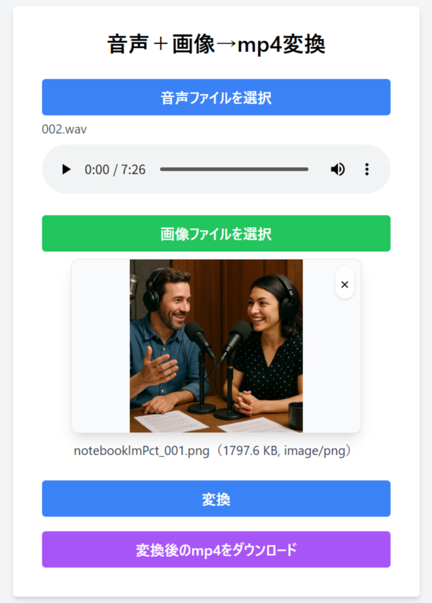

# mp3tomp4 Project

[](LICENSE)
[](https://www.python.org/)
[](https://ffmpeg.org/)

---


このプロジェクトは、音声ファイル（例: mp3, wav）と画像ファイルを組み合わせて、mp4動画ファイルを作成するためのものです。

## 使い方（2通り）

- **1. コマンドライン一括変換（main.py）**
- **2. Webアプリ（webapp.py / Docker）でブラウザから変換**

---

## 1. コマンドライン一括変換（main.py）

### 必要なソフトウェア
- Python 3.7以上
- ffmpeg

### セットアップ
```sh
git clone https://github.com/cwnakayama/mp3tomp4.git
cd mp3tomp4
pip install -r requirements.txt
```

### ディレクトリ準備
```sh
mkdir -p audio/comitted pict mp4
```

### 使い方
- 変換したい音声ファイル（.mp3, .wavなど）を `audio/` フォルダに入れる
- 画像ファイル（.png, .jpgなど）を `pict/` フォルダに入れる
- 下記コマンドで一括変換

```sh
python main.py
```

- 変換後のmp4は `mp4/` に保存
- 変換済み音声は `audio/comitted/` に自動移動

---

## 2. Webアプリ（webapp.py / Docker）


### 特徴
- ブラウザから音声＋画像をアップロードし、mp4を生成
- 進捗バーで変換状況がリアルタイム表示
- 画像・音声のプレビュー、DLボタン付きのモダンUI
- Dockerで簡単に起動可能

### 必要なソフトウェア
- Python 3.7以上 & Flask
- ffmpeg
- または Docker

### Pythonで直接起動
```sh
pip install -r requirements.txt
python webapp.py
```
- ブラウザで http://localhost:5000/ にアクセス

### Dockerで起動
```sh
docker build -t mp3tomp4-webapp .
docker run --rm -p 5000:5000 mp3tomp4-webapp
```
- ブラウザで http://localhost:5000/ にアクセス

### 使い方
1. 「音声ファイルを選択」「画像ファイルを選択」ボタンでファイルをアップロード
2. プレビューで内容を確認
3. 「変換」ボタンでmp4生成（進捗バー表示）
4. 変換完了後、「ダウンロード」ボタンでmp4を取得

---

## ディレクトリ構成と役割

- `audio/` : mp4変換前の音声ファイルを格納
    - `comitted/` : mp4ファイルに変換済みの元音声ファイルを移動
- `pict/` : mp4作成時に使用する画像ファイルを格納
- `mp4/` : 生成されたmp4ファイルを格納

## 注意事項
- ffmpegが必要です。インストール方法例：
    - Ubuntu/Debian: `sudo apt install ffmpeg`
    - Mac: `brew install ffmpeg`
    - Windows: [公式サイト](https://ffmpeg.org/download.html)からDLしパスを通す
- 画像ファイルはmp4作成時のサムネイルや背景として使用されます。
- 変換後のmp4ファイルは `mp4/` フォルダに保存されます。
- 変換済みの音声ファイルは `audio/comitted/` に移動します。

---

## ライセンス
MIT License
